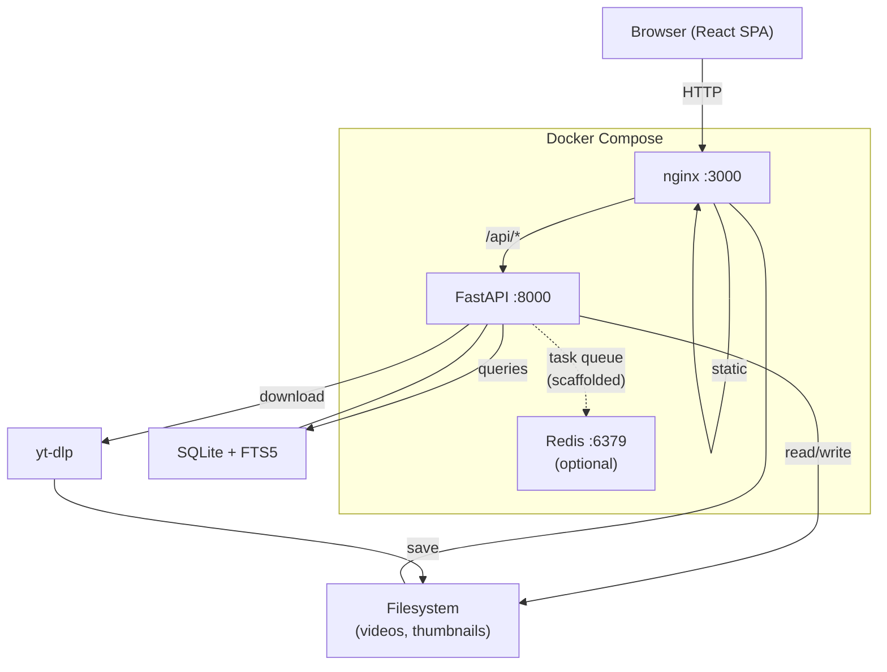
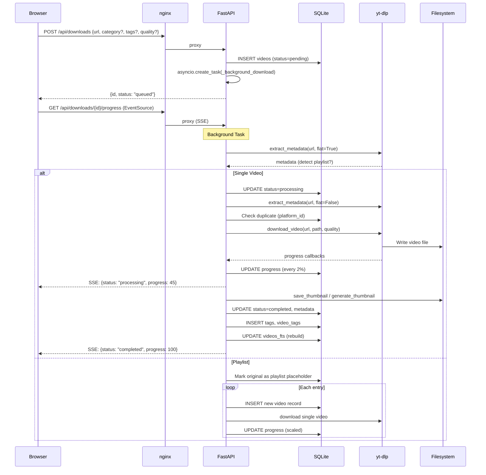
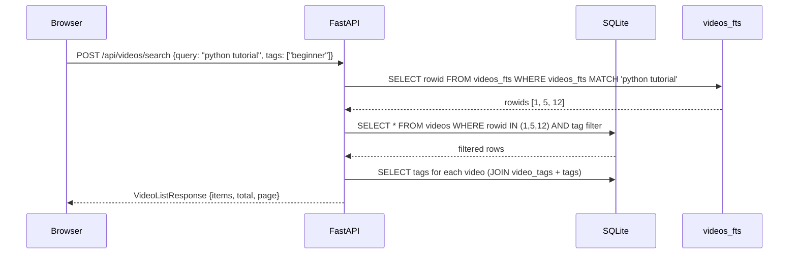
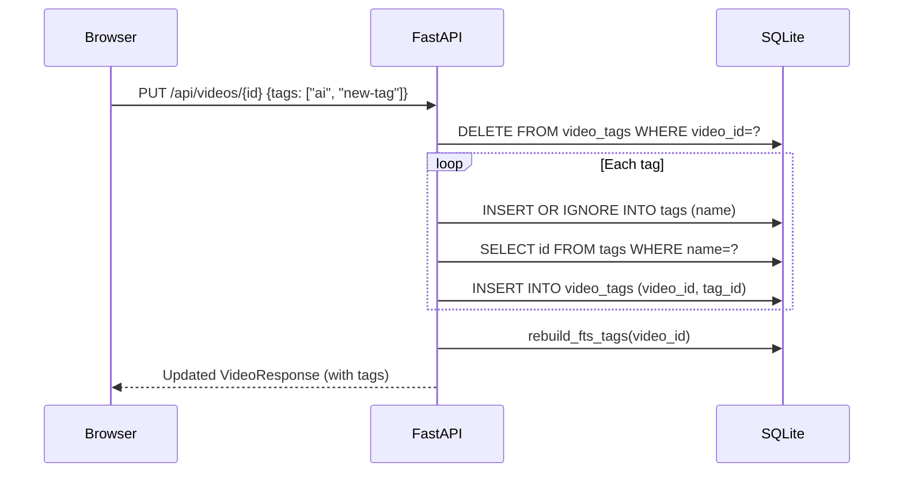
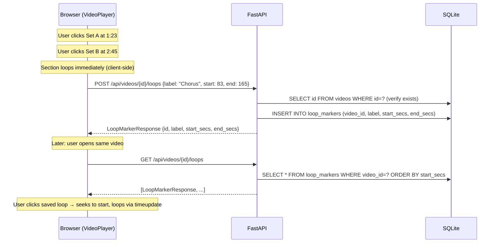

# Magpie — Developer Guide

## 1. Project Overview

Magpie is a self-hosted web application that downloads, organizes, and streams videos from 1000+ platforms (YouTube, Instagram, TikTok, Twitter/X, and anything else supported by yt-dlp). Users submit a URL, the system downloads the video in the background, automatically categorizes it, and stores it with metadata for later browsing, searching, and streaming.

The system is designed for personal or small-team use on a home server or NAS. It prioritizes simplicity and offline-first operation — SQLite for the database, local filesystem for storage, and a single Docker Compose stack for deployment.

**Intended users:** Individuals who want a private, self-hosted video library with a web UI. Chatbot operators who want to trigger downloads via Telegram/Discord bots. Developers building automation around video archival.

**Key design goals:**
- Zero-config deployment via Docker Compose
- Automatic categorization and tagging
- Full-text search across all video metadata
- Real-time download progress via SSE
- Support for playlists and batch downloads
- NAS-friendly storage layout

**Non-goals:**
- Multi-user authentication (designed for trusted private networks)
- Horizontal scaling (single-server SQLite architecture)
- Video transcoding or format conversion

---

## 2. Architecture Overview



### Component Responsibilities

| Component | Role |
|---|---|
| **nginx** | Serves the React SPA, reverse-proxies `/api/*` to FastAPI, serves static thumbnails |
| **FastAPI** | REST API, SSE progress streaming, background download tasks, static file mount for thumbnails |
| **SQLite + FTS5** | All persistent state — videos, tags, categories, download logs, full-text search index |
| **Filesystem** | Video files organized by category, thumbnail images, database file |
| **yt-dlp** | Video metadata extraction and downloading (runs in executor threads) |
| **Redis** | Scaffolded for future task queue (arq) — currently unused; downloads use in-memory asyncio tasks |

### Communication Patterns

| From → To | Protocol | Notes |
|---|---|---|
| Browser → nginx | HTTP/HTTPS | SPA routing, API proxy |
| nginx → FastAPI | HTTP (reverse proxy) | SSE requires `proxy_buffering off` |
| FastAPI → SQLite | aiosqlite (async) | WAL mode for concurrent reads |
| FastAPI → yt-dlp | Thread executor | Blocking I/O wrapped in `run_in_executor` |
| FastAPI → Browser | SSE | Download progress streaming via `EventSource` |
| Chatbot → FastAPI | HTTP POST | Webhook endpoint with API key auth |

### Technology Stack

| Layer | Technology | Version |
|---|---|---|
| Language (backend) | Python | 3.12 |
| Framework | FastAPI | ≥0.104 |
| Language (frontend) | TypeScript | ≥5.4 |
| UI Framework | React | 18.x |
| State Management | Zustand | 4.x |
| CSS | Tailwind CSS | 3.x |
| Charts | recharts | 2.x |
| Drag-and-drop | @dnd-kit | 6.x |
| Build Tool | Vite | 5.x |
| Database | SQLite (aiosqlite) | FTS5 enabled |
| Video Downloads | yt-dlp | ≥2024.01 |
| HTTP Client | httpx | ≥0.25 |
| Logging | structlog | ≥24.1 |
| Containerization | Docker + docker-compose | — |
| Reverse Proxy | nginx (dev), Caddy (prod) | — |

---

## 3. Repository Structure

```
magpie/
├── backend/                        # Python FastAPI application
│   ├── app/
│   │   ├── main.py                 # App factory, middleware, router registration
│   │   ├── config.py               # Pydantic Settings (env vars)
│   │   ├── database.py             # SQLite schema, init, connection helpers
│   │   ├── models/                 # Pydantic request/response schemas
│   │   │   ├── video.py            # VideoResponse, DownloadRequest, SearchRequest, etc.
│   │   │   ├── tag.py              # TagCreate, TagResponse
│   │   │   ├── category.py         # CategoryCreate, CategoryResponse
│   │   │   ├── loop_marker.py     # LoopMarkerCreate, LoopMarkerResponse
│   │   │   └── compilation.py    # CompilationCreate/Update/Response, ClipCreate/Update/Response
│   │   ├── routers/                # FastAPI route handlers
│   │   │   ├── videos.py           # /api/videos/* CRUD, search, streaming, thumbnails
│   │   │   ├── downloads.py        # /api/downloads/* start, status, SSE, cancel
│   │   │   ├── tags.py             # /api/tags/* CRUD
│   │   │   ├── categories.py       # /api/categories/* CRUD
│   │   │   ├── webhook.py          # /api/webhook/ingest (chatbot integration)
│   │   │   ├── settings.py         # /api/settings, /api/health
│   │   │   ├── loop_markers.py    # /api/videos/{id}/loops CRUD
│   │   │   ├── analytics.py      # /api/analytics aggregated metrics
│   │   │   └── compilations.py  # /api/compilations CRUD, clips, render, stream
│   │   ├── services/               # Business logic layer
│   │   │   ├── downloader.py       # yt-dlp wrappers (extract_metadata, download_video)
│   │   │   ├── search.py           # FTS5 search queries, FTS index rebuild
│   │   │   ├── categorizer.py      # Regex-based auto-categorization
│   │   │   ├── thumbnail.py        # Thumbnail download (httpx) and generation (ffmpeg)
│   │   │   ├── notifier.py         # Webhook callback notification manager
│   │   │   └── renderer.py        # ffmpeg compilation rendering
│   │   ├── tasks/
│   │   │   └── download_task.py    # Main download pipeline (single + playlist)
│   │   └── utils/
│   │       ├── url_parser.py       # Platform detection, video ID extraction
│   │       └── file_utils.py       # Filename sanitization, storage paths, disk stats
│   ├── tests/                      # pytest test suite (189 tests)
│   ├── Dockerfile                  # Python 3.12-slim + ffmpeg
│   ├── pyproject.toml              # Dependencies, tool config
│   ├── import_existing.py          # Utility: import existing video files into DB
│   └── rebuild_fts.py              # Utility: rebuild FTS index from scratch
├── frontend/                       # React TypeScript SPA
│   ├── src/
│   │   ├── main.tsx                # React entry point
│   │   ├── App.tsx                 # Router configuration
│   │   ├── api/client.ts           # Axios API client with all endpoint methods
│   │   ├── store/index.ts          # Zustand global state store
│   │   ├── types/index.ts          # TypeScript interfaces
│   │   ├── hooks/                  # Custom React hooks
│   │   │   ├── useDownload.ts      # Download submission + SSE progress tracking
│   │   │   ├── useSearch.ts        # Debounced search with auto-navigation
│   │   │   ├── useVideos.ts        # Paginated video listing with filters
│   │   │   └── useTags.ts          # Tag management hook
│   │   ├── pages/                  # Route-level page components
│   │   │   ├── Dashboard.tsx       # Stats, quick download, recent videos
│   │   │   ├── Browse.tsx          # Filterable video grid with pagination
│   │   │   ├── Download.tsx        # Full download form
│   │   │   ├── Search.tsx          # Search results page
│   │   │   ├── VideoView.tsx       # Single video detail + player
│   │   │   ├── Analytics.tsx      # Analytics dashboard with recharts
│   │   │   ├── Compilations.tsx   # Compilation list page
│   │   │   ├── CompilationEditor.tsx # Compilation editor with clips, timeline, render
│   │   │   └── Settings.tsx        # Configuration management
│   │   └── components/             # Reusable UI components
│   │       ├── layout/             # Header, Sidebar, Layout shell
│   │       ├── video/              # VideoCard, VideoGrid, VideoPlayer, VideoDetail, DownloadForm
│   │       ├── tags/               # TagBadge, TagInput, TagManager
│   │       ├── search/             # SearchBar
│   │       └── settings/           # StorageConfig, CategoryManager
│   ├── Dockerfile                  # Node 20 build → nginx serve
│   ├── nginx.conf                  # Reverse proxy + SPA fallback
│   └── package.json                # Dependencies
├── bots/                           # Chatbot adapters
│   ├── telegram_bot.py             # Telegram bot → webhook
│   └── discord_bot.py              # Discord bot → webhook
├── docs/
│   ├── DESIGN.md                   # Architecture & design document
│   ├── DEVELOPER_GUIDE.md          # This file
│   └── COMPILATION_DESIGN.md       # Compilation feature design (planned)
├── deploy/
│   ├── docker-compose.yml          # Local development stack
│   ├── docker-compose.nas.yml      # NAS deployment variant
│   └── Caddyfile                   # Production reverse proxy config
├── assets/                         # Logo images
└── README.md                       # Project overview
```

### Naming Conventions

- **Backend modules:** `snake_case` for files and functions, `PascalCase` for Pydantic models
- **Frontend files:** `PascalCase.tsx` for components, `camelCase.ts` for hooks/utils
- **API routes:** kebab-case paths (`/api/videos/regenerate-thumbnails`)
- **Database:** `snake_case` for table and column names
- **Tags:** case-insensitive (`COLLATE NOCASE` in SQLite)

---

## 4. Core Concepts & Domain Model

### Domain Entities

| Entity | Description | Storage |
|---|---|---|
| **Video** | A downloaded video with metadata (title, uploader, duration, resolution, category, tags, file path) | `videos` table + filesystem |
| **Tag** | A free-form label applied to videos (many-to-many) | `tags` + `video_tags` tables |
| **Category** | A classification for organizing videos into filesystem directories | `categories` table + filesystem dirs |
| **Download** | An in-progress video download tracked as an asyncio task | `videos` table (status/progress columns) + in-memory task map |
| **DownloadLog** | Audit trail of download attempts | `download_log` table |
| **LoopMarker** | A saved A-B repeat region within a video (label, start/end times) | `loop_markers` table |
| **Compilation** | A user-created video made from clips of existing videos | `compilations` table + filesystem |
| **CompilationClip** | A time range from a source video, with position in a compilation | `compilation_clips` table |

### Key Abstractions

| Abstraction | Location | Purpose |
|---|---|---|
| `Settings` | `app/config.py` | Pydantic `BaseSettings` — all configuration loaded from env vars |
| `get_db_dep` | `app/database.py` | FastAPI dependency that yields an `aiosqlite.Connection` |
| `NotificationManager` | `app/services/notifier.py` | Singleton that manages webhook callback URLs and sends notifications |
| `active_tasks` | `app/routers/downloads.py` | In-memory `dict[str, asyncio.Task]` tracking running downloads |
| `videos_fts` | SQLite FTS5 virtual table | Full-text search index over title, description, uploader, tags |

### Glossary

| Term | Meaning |
|---|---|
| **platform** | The source website (youtube, instagram, tiktok, twitter, other) |
| **platform_id** | The platform-specific video identifier (e.g., YouTube video ID) |
| **FTS5** | SQLite Full-Text Search extension version 5 |
| **SSE** | Server-Sent Events — one-way streaming from server to browser |
| **flat extraction** | yt-dlp mode that fetches playlist structure without full metadata per entry |
| **triggered_by** | String identifying who started a download (api, webhook:source, callback:id) |

---

## 5. Data Flow & Key Workflows

### 5.1 Video Download (End-to-End)



#### Function Call Chain — Single Video Download

```
routers/downloads.py::start_download()
  ├── db.execute("INSERT INTO videos ...")        # Create initial record
  ├── asyncio.create_task(_background_download)   # Spawn background task
  └── return {id, status: "queued"}

routers/downloads.py::_background_download()
  └── tasks/download_task.py::process_download()
        ├── db.execute("UPDATE videos SET status='processing'")
        ├── services/downloader.py::extract_metadata(url, flat=True)
        │     └── yt_dlp.YoutubeDL.extract_info(url, download=False)
        ├── [if playlist] → _process_playlist()
        └── [if single]  → _download_single_video()

tasks/download_task.py::_download_single_video()
  ├── services/downloader.py::extract_metadata(url, flat=False)
  ├── utils/url_parser.py::detect_platform(url)
  ├── utils/url_parser.py::extract_video_id(url, platform)
  ├── db.execute("SELECT id FROM videos WHERE platform_id=?")  # Duplicate check
  │     └── [if exists] → DELETE record, return "duplicate"
  ├── services/categorizer.py::auto_categorize(title, desc, platform, duration)
  ├── utils/file_utils.py::ensure_category_dir(storage_root, category)
  ├── utils/file_utils.py::safe_filename(title)
  ├── services/downloader.py::download_video(url, path, quality, progress_callback)
  │     ├── yt_dlp.YoutubeDL.extract_info(url, download=True)
  │     └── progress_callback → _update_progress() → db.execute("UPDATE progress")
  ├── services/thumbnail.py::save_thumbnail(thumbnail_url, storage_root, video_id)
  │     └── [fallback] services/thumbnail.py::generate_thumbnail(file, storage_root, id)
  │           └── ffmpeg -i file -ss 00:00:01 -vframes 1 -vf scale=640:-1
  ├── db.execute("UPDATE videos SET status='completed', title=?, ...")
  ├── _apply_tags()
  │     ├── db.execute("INSERT OR IGNORE INTO tags (name)")
  │     └── db.execute("INSERT OR IGNORE INTO video_tags (video_id, tag_id)")
  ├── services/search.py::rebuild_fts_tags(db, video_id)
  │     ├── db.execute("DELETE FROM videos_fts WHERE rowid=?")
  │     └── db.execute("INSERT INTO videos_fts(rowid, title, desc, uploader, tags)")
  └── db.execute("INSERT INTO download_log ...")
```

### 5.2 Full-Text Search



#### Function Call Chain — Search

```
routers/videos.py::search()
  └── services/search.py::search_videos(db, query, category, tags, page, per_page)
        ├── Build SQL: "WHERE v.rowid IN (SELECT rowid FROM videos_fts WHERE MATCH ?)"
        ├── [if category] append "AND v.category = ?"
        ├── [if tags] append "AND v.id IN (SELECT video_id FROM video_tags JOIN tags ...)"
        ├── db.execute(count_sql)    # total count
        ├── db.execute(sql)          # paginated results
        └── Parse tags: GROUP_CONCAT(t.name) → split into list
```

### 5.3 Video Edit (Tags Update)



### 5.4 SSE Progress Streaming

#### Function Call Chain — Progress Stream

```
routers/downloads.py::stream_download_progress(video_id)
  └── event_generator() [async generator]
        ├── aiosqlite.connect(db_path)   # Own connection (not request-scoped)
        ├── db.execute("SELECT status FROM videos WHERE id=?")  # Existence check
        └── while True:
              ├── db.execute("SELECT status, progress, error_message FROM videos")
              ├── [if changed] yield f'data: {json}\n\n'
              ├── [if terminal status] break
              └── await asyncio.sleep(1)
```

### 5.5 Thumbnail Pipeline

#### Function Call Chain — Thumbnail

```
services/thumbnail.py::save_thumbnail(url, storage_root, video_id)
  ├── [if url is empty/None] return None
  ├── httpx.AsyncClient.get(url, follow_redirects=True)
  ├── Path(thumbnails/{video_id}.jpg).write_bytes(response.content)
  └── return "thumbnails/{video_id}.jpg"

services/thumbnail.py::generate_thumbnail(video_file, storage_root, video_id)
  ├── [if video_file doesn't exist] return None
  ├── asyncio.create_subprocess_exec("ffmpeg", "-i", video_file,
  │     "-ss", "00:00:01", "-vframes", "1", "-vf", "scale=640:-1",
  │     "-y", thumbnail_path)
  └── return "thumbnails/{video_id}.jpg"
```

### 5.6 Loop Marker (A-B Repeat)



#### Function Call Chain — Loop Markers

```
routers/loop_markers.py::create_loop_marker(video_id, marker)
  ├── db.execute("SELECT id FROM videos WHERE id=?")    # Verify video exists
  ├── Validate start_secs < end_secs
  ├── db.execute("INSERT INTO loop_markers ...")
  ├── db.commit()
  └── return LoopMarkerResponse

routers/loop_markers.py::update_loop_marker(video_id, loop_id, update)
  ├── db.execute("SELECT id FROM loop_markers WHERE id=? AND video_id=?")
  ├── db.execute("UPDATE loop_markers SET label=? WHERE id=?")
  ├── db.commit()
  └── return LoopMarkerResponse

Frontend VideoPlayer.tsx:
  ├── useEffect → apiClient.getLoopMarkers(videoId)      # Load on mount
  ├── handleSetA() → markA = videoRef.currentTime
  ├── handleSetB() → markB = videoRef.currentTime, start looping
  ├── useEffect [activeLoop] → video.addEventListener('timeupdate', ...)
  │     └── if (currentTime >= end) video.currentTime = start
  ├── handleSaveLoop() → apiClient.createLoopMarker(videoId, {label, start, end})
  ├── handleSaveRename(m) → apiClient.updateLoopMarker(videoId, m.id, {label})
  └── handleDeleteLoop() → apiClient.deleteLoopMarker(videoId, loopId)
```

### 5.7 Webhook Ingest

#### Function Call Chain — Webhook

```
routers/webhook.py::webhook_ingest(body, x_api_key)
  ├── Validate x_api_key == settings.API_KEY
  ├── Extract url, source, category, tags, callback_id from body
  ├── db.execute("INSERT INTO videos ...")
  ├── [if callback_id] notifier.register_callback(callback_id, url)
  ├── asyncio.create_task(_background_download(..., triggered_by="webhook:source"))
  └── return {status: "queued", video_id}
```

---

## 6. Development Environment Setup

### Prerequisites

| Tool | Version | Install |
|---|---|---|
| Docker | ≥20.x | [docker.com](https://docker.com) |
| Docker Compose | ≥2.x | Included with Docker Desktop |
| Python | 3.12+ | Only needed for running tests locally |
| Node.js | 20+ | Only needed for frontend development |

### Step-by-Step Local Setup

```bash
# 1. Clone the repository
git clone <repo-url>
cd magpie

# 2. (Optional) Create a .env file for custom settings
cat > .env <<EOF
API_KEY=my-secret-key
STORAGE_PATH=./storage
DEFAULT_QUALITY=1080
MAX_CONCURRENT_DOWNLOADS=3
EOF

# 3. Start the full stack
docker compose up --build -d

# 4. Verify all services are running
docker compose ps
# Expected: magpie-backend, magpie-frontend, magpie-redis all "Up"

# 5. Check health
curl http://localhost:8000/api/health

# 6. Open the UI
open http://localhost:3000
```

### Environment Variables

| Variable | Default | Required | Description |
|---|---|---|---|
| `STORAGE_ROOT` | `./storage` | No | Root directory for all data (videos, DB, thumbnails) |
| `STORAGE_PATH` | `./storage` | No | Docker volume mount path (docker-compose) |
| `REDIS_URL` | `redis://localhost:6379` | No | Redis connection URL (currently unused) |
| `API_KEY` | `changeme` | **Yes (prod)** | API key for webhook authentication |
| `DEFAULT_QUALITY` | `1080` | No | Default download quality in pixels |
| `DEFAULT_FORMAT` | `mp4` | No | Default video format |
| `MAX_CONCURRENT_DOWNLOADS` | `3` | No | Max simultaneous downloads |
| `API_HOST` | `0.0.0.0` | No | Backend bind address |
| `API_PORT` | `8000` | No | Backend port |

### Common Setup Pitfalls

| Problem | Solution |
|---|---|
| Port 3000/8000 in use | Stop conflicting services or change ports in docker-compose.yml |
| Thumbnails not loading | Hard-refresh browser (Cmd+Shift+R) — may be cached old JS bundle |
| "version" warning in docker compose | Harmless — the `version` key in docker-compose.yml is deprecated |
| ffmpeg not found | ffmpeg is installed in the backend Dockerfile; ensure you're running in Docker |

---

## 7. How to Run the Code

### Full System (Docker)

```bash
# Start all services
docker compose up --build -d

# View logs
docker compose logs -f backend
docker compose logs -f frontend

# Stop all services
docker compose down

# Rebuild after code changes
docker compose up --build -d backend   # backend only
docker compose up --build -d frontend  # frontend only
```

### Backend Only (Development)

```bash
cd backend
pip install -e ".[dev]"
uvicorn app.main:app --host 0.0.0.0 --port 8000 --reload
```

### Frontend Only (Development)

```bash
cd frontend
npm install
npm run dev   # Starts Vite dev server with HMR on port 5173
```

> ⚠️ Note: Frontend dev server needs the backend running for API calls. Configure the Vite proxy in `vite.config.ts` if running outside Docker.

### NAS Deployment

```bash
docker compose -f docker-compose.nas.yml up -d
```

### Production (Caddy)

Configure your domain in `Caddyfile`, then:

```bash
docker compose up -d
caddy run --config Caddyfile
```

---

## 8. Testing Guide

### Testing Philosophy

- **Unit tests** cover pure business logic (categorizer, URL parser, file utils, models, search)
- **Integration tests** cover API endpoints with a real SQLite database (in temp dirs)
- **Mocked tests** cover external dependencies (httpx for thumbnails, ffmpeg, yt-dlp)
- **No e2e tests** currently — manual testing via the UI or curl

### Running Tests

```bash
# Install test dependencies in container
docker exec magpie-backend pip install pytest pytest-asyncio pytest-cov

# Copy tests into container (if not in Docker image)
docker cp backend/tests magpie-backend:/app/

# Run all tests
docker exec -w /app magpie-backend python -m pytest tests/ -v

# Run a specific test file
docker exec -w /app magpie-backend python -m pytest tests/test_url_parser.py -v

# Run a specific test class
docker exec -w /app magpie-backend python -m pytest tests/test_categorizer.py::TestAutoCategorizeTech -v

# Run a single test
docker exec -w /app magpie-backend python -m pytest tests/test_url_parser.py::TestDetectPlatform::test_youtube_watch_url -v

# Run with coverage
docker exec -w /app magpie-backend python -m pytest tests/ --cov=app --cov-report=term-missing
```

### Test Organization

| File | Tests | What It Covers |
|---|---|---|
| `test_url_parser.py` | 27 | Platform detection, video ID extraction |
| `test_file_utils.py` | 13 | Filename sanitization, paths, storage stats |
| `test_categorizer.py` | 24 | Auto-categorization rules and priority |
| `test_models.py` | 18 | Pydantic validation, thumbnail path prefix |
| `test_database.py` | 16 | Schema init, indexes, default data, helpers |
| `test_search.py` | 11 | FTS5 search, tag/category filters, FTS rebuild |
| `test_notifier.py` | 9 | Callback management, notification sending |
| `test_config.py` | 8 | Settings defaults, derived paths |
| `test_thumbnail.py` | 6 | Thumbnail download/generation |
| `test_api_videos.py` | 14 | Video CRUD endpoints |
| `test_api_tags.py` | 7 | Tag CRUD endpoints |
| `test_api_categories.py` | 7 | Category CRUD endpoints |
| `test_api_loop_markers.py` | 14 | Loop marker CRUD, rename, cascade delete, validation |
| `test_api_compilations.py` | 20 | Compilation CRUD, clip management, reorder, loop import, cascade |

### Fixtures (conftest.py)

| Fixture | Scope | Purpose |
|---|---|---|
| `tmp_storage` | function | Creates temp storage dir with db/, categories/, thumbnails/ |
| `settings` | function | `Settings` pointing to temp storage |
| `db` | function | Initialized SQLite connection with full schema |
| `db_with_videos` | function | DB seeded with 4 sample videos, 3 tags, FTS index |

### Writing a New Test

Follow this pattern from the codebase:

```python
# tests/test_my_feature.py
import pytest
from app.services.my_service import my_function

class TestMyFunction:
    """Tests for my_function()."""

    def test_basic_case(self):
        result = my_function("input")
        assert result == "expected"

    def test_edge_case(self):
        result = my_function("")
        assert result is None

# For async tests:
@pytest.mark.asyncio
class TestAsyncFeature:
    async def test_with_db(self, db_with_videos):
        result = await async_function(db_with_videos, "query")
        assert len(result) > 0

# For API tests:
@pytest.mark.asyncio
class TestEndpoint:
    async def test_create(self, client):
        resp = await client.post("/api/things", json={"name": "test"})
        assert resp.status_code == 201
```

---

## 9. Key Modules Deep Dive

### 9.1 `app/tasks/download_task.py` — Download Pipeline

**Purpose:** Orchestrates the entire download lifecycle from URL to saved file.

**Public API:**
- `process_download(db_path, storage_root, video_id, url, category, tags, quality, triggered_by, notifier)` — Main entry point

**Internal functions:**
- `_download_single_video()` — Downloads one video, handles metadata, thumbnails, tags, FTS
- `_process_playlist()` — Iterates playlist entries, creates per-video records, delegates to `_download_single_video()`
- `_apply_tags()` — Creates tags (INSERT OR IGNORE) and links to video
- `_update_progress()` — Writes progress percentage to DB

**Gotchas:**
- Duration from yt-dlp can be a float (e.g., Instagram reels) — must be cast to `int` before storing
- Duplicate detection uses `(platform_id, platform)` — if a duplicate is found, the new record is **deleted** (not kept as "duplicate")
- Playlist progress is scaled: if 10 videos, each gets 10% of the 0-100 range
- The function opens its own DB connection (`aiosqlite.connect(db_path)`) because it runs as a background task outside the request lifecycle

### 9.2 `app/services/search.py` — Full-Text Search

**Purpose:** FTS5-based search across video metadata.

**Public API:**
- `search_videos(db, query, category, tags, page, per_page)` → `(list[dict], int)`
- `rebuild_fts_tags(db, video_id)` — Rebuild FTS entry after tag changes

**Important behavior:**
- The FTS join uses `v.rowid` (not `v.id`) because FTS5 rowids are integers while video IDs are UUIDs
- Tags are stored space-separated in the FTS index for proper tokenization
- `rebuild_fts_tags` deletes and re-inserts the FTS row (no UPDATE for FTS5 standalone tables)

### 9.3 `app/services/categorizer.py` — Auto-Categorization

**Purpose:** Assigns a category to videos based on metadata patterns.

**Public API:**
- `auto_categorize(title, description, platform, duration)` → `str`

**Logic priority:**
1. Platform is instagram/tiktok OR duration < 60s → `"short-form"`
2. Title+description matched against `CATEGORY_RULES` regex dict → first match wins
3. No match → `"uncategorized"`

**Gotcha:** The gaming regex includes `game` which can match non-gaming content. Category rules are checked in dict insertion order.

### 9.4 `app/services/thumbnail.py` — Thumbnail Management

**Purpose:** Download thumbnails from URLs or generate from video files.

**Public API:**
- `save_thumbnail(url, storage_root, video_id)` → `Optional[str]`
- `generate_thumbnail(video_file, storage_root, video_id)` → `Optional[str]`

**Important:** Both return a **relative path** (`thumbnails/VIDEO_ID.jpg`). The `VideoResponse` model validator prefixes it with `/api/` so the browser can resolve it through the nginx proxy to FastAPI's static file mount.

### 9.5 `app/models/video.py` — VideoResponse Model

**Important behavior:** The `VideoResponse` model has a `@model_validator(mode="before")` that automatically prefixes `thumbnail_path` with `/api/` if it doesn't already start with `/`. This means:
- DB stores: `thumbnails/abc.jpg`
- API returns: `/api/thumbnails/abc.jpg`
- Browser resolves: `http://host:3000/api/thumbnails/abc.jpg` → nginx → FastAPI static mount

### 9.6 `app/routers/downloads.py` — SSE Progress

**Important behavior:**
- The SSE endpoint opens its **own database connection** (not the request-scoped one) because the streaming generator outlives the request dependency lifecycle
- Events are only sent when progress or status changes (not every poll)
- Terminal statuses: `completed`, `failed`, `duplicate`
- The `close` event is sent after the final data event

### 9.7 `app/routers/loop_markers.py` — A-B Loop Markers

**Purpose:** CRUD endpoints for saving loop regions on videos. Designed for music practice — users mark a start and end point to repeat a section.

**Endpoints:**
- `GET /api/videos/{video_id}/loops` — List all saved loops for a video, ordered by `start_secs`
- `POST /api/videos/{video_id}/loops` — Create a loop marker (validates video exists, `start < end`)
- `PUT /api/videos/{video_id}/loops/{loop_id}` — Rename a loop marker (validates ownership by `video_id`)
- `DELETE /api/videos/{video_id}/loops/{loop_id}` — Delete a loop marker (validates ownership by `video_id`)

**Database table:** `loop_markers`
| Column | Type | Description |
|---|---|---|
| `id` | INTEGER PK | Auto-increment |
| `video_id` | TEXT FK | References `videos(id)` with CASCADE delete |
| `label` | TEXT | User-provided name (e.g. "Chorus", "Bridge") |
| `start_secs` | REAL | Loop start time in seconds |
| `end_secs` | REAL | Loop end time in seconds |
| `created_at` | TEXT | ISO timestamp |

**Models:**
- `LoopMarkerCreate` — `label`, `start_secs`, `end_secs` (all required)
- `LoopMarkerUpdate` — `label` only (for rename)
- `LoopMarkerResponse` — full record including `id`, `video_id`, `created_at`

**Gotchas:**
- Cascade delete ensures loops are cleaned up when a video is deleted — requires `PRAGMA foreign_keys = ON` (set per-connection in `database.py`)
- Times are stored as floats (REAL) to support sub-second precision from the HTML5 `<video>` element
- All endpoints validate `video_id` ownership — you can't modify a loop marker by passing a different video's ID

### 9.8 Frontend `VideoPlayer.tsx` — Loop Playback

**Purpose:** Enhanced video player with A-B repeat functionality.

**Key mechanism:** The HTML5 `<video>` element fires `timeupdate` events ~4 times/second. An `useEffect` hook attaches a listener that checks if `currentTime >= end_secs` and seeks back to `start_secs`:

```typescript
// Core loop logic
useEffect(() => {
  const video = videoRef.current
  if (!video || !activeLoop) return
  const onTimeUpdate = () => {
    if (video.currentTime >= activeLoop.end_secs) {
      video.currentTime = activeLoop.start_secs
    }
  }
  video.addEventListener('timeupdate', onTimeUpdate)
  return () => video.removeEventListener('timeupdate', onTimeUpdate)
}, [activeLoop])
```

**User flow:**
1. Click **Set A** → captures `videoRef.current.currentTime`
2. Click **Set B** → captures end time, starts looping immediately (unsaved preview)
3. Type a label and click **Save** → `POST /api/videos/{id}/loops`
4. Saved loops appear in a list — click play to activate, pencil to rename, trash to delete
5. Click pencil icon → inline text input replaces label, Enter to confirm, Escape to cancel → `PUT /api/videos/{id}/loops/{loop_id}`
6. Click **Stop Loop** to resume normal playback

**State management:**
- `markA` / `markB` — transient A-B points before saving
- `activeLoop` — the currently looping `LoopMarker` (or `null`)
- `loopMarkers` — all saved loops, fetched on mount via `GET /api/videos/{id}/loops`
- `editingId` / `editLabel` — tracks which loop is being renamed inline
- Two separate `useEffect` hooks: one for saved active loops, one for unsaved A-B preview

**Visual indicators:** Colored bars overlaid near the video progress bar showing loop regions (blue for saved, yellow for unsaved preview, green for active).

### 9.9 `app/routers/analytics.py` — Analytics Dashboard

**Purpose:** Single endpoint that computes all analytics metrics via SQL aggregation queries against existing tables. No separate storage or schema changes needed — metrics update automatically with every download.

**Endpoint:**
- `GET /api/analytics` — Returns a JSON object with four top-level sections

**Response structure:**
```
{
  "storage": {
    "total_bytes", "total_completed",
    "by_category": [{category, count, total_bytes}],
    "by_platform": [{platform, count, total_bytes}],
    "largest_videos": [{id, title, file_size_bytes, ...}],
    "growth": [{month, count, monthly_bytes, cumulative_bytes}]
  },
  "collection": {
    "by_status", "by_platform", "by_category",
    "top_uploaders": [{uploader, count, total_bytes}],
    "download_success_rate": {total, completed, failed, duplicate}
  },
  "content": {
    "duration_distribution": [{label, count}],
    "resolution_breakdown", "size_distribution",
    "top_tags": [{name, count}],
    "avg_duration", "avg_duration_by_platform"
  },
  "activity": {
    "daily_downloads": [{day, count}],
    "by_day_of_week": [{day_name, count}],
    "recent": {last_7_days, prior_7_days},
    "loop_markers": {total_loops, videos_with_loops}
  }
}
```

**Implementation notes:**
- All metrics are computed in a single request via ~20 SQL queries
- Storage growth uses cumulative sum computed in Python after fetching monthly aggregates
- Duration/size distributions use SQL CASE expressions with predefined bucket ranges
- No caching — queries are fast on SQLite for typical personal library sizes (<10K videos)

### 9.10 Frontend `Analytics.tsx` — Visualizations

**Purpose:** Full-page analytics dashboard using recharts for interactive charts.

**Charts used:**
- `BarChart` — Storage by category (horizontal), videos by platform, download status, duration/size distributions, tags, avg duration by platform, downloads by day of week
- `PieChart` — Storage by platform, videos by category, resolution breakdown
- `AreaChart` — Storage growth over time (cumulative)
- `LineChart` — Daily downloads (last 30 days)

**Component structure:**
- `StatCard` — Summary metric with icon, value, and subtitle
- `Section` — Titled section wrapper with border
- `ChartCard` — Card container for individual charts
- All chart data comes from a single `GET /api/analytics` call on mount

**Gotchas:**
- Recharts Pie `label` props need `(props: any)` casting to avoid TypeScript `PieLabelRenderProps` type conflicts
- Tooltip `formatter` needs `(v) => fn(v as number)` casting for recharts type compatibility
- Empty data states show "No data yet" placeholder instead of empty charts

### 9.11 `app/routers/compilations.py` — Compilation CRUD + Render

**Purpose:** Full CRUD for compilations and their clips, plus codec analysis and ffmpeg render pipeline.

**Endpoints (15 total):**
- Compilation CRUD: create, list (with ?q= search), get, update, delete
- Clip management: add, update, delete, reorder, import from loop marker
- Render: analyze, render (background task), progress SSE, stream output
- `GET /api/videos/{id}/deletion-check` (on videos router) — checks if video is referenced

**Key implementation details:**
- Route ordering matters: `PUT .../clips/reorder` must be defined before `PUT .../clips/{clip_id}` to avoid FastAPI treating "reorder" as a clip ID
- Clips auto-position (MAX+1) on add, auto-reorder on delete
- Status guard prevents clip modification during rendering or after completion
- Render launches `asyncio.create_task` for background ffmpeg work
- The `_build_response` helper joins clips with source video metadata (title, thumbnail)

### 9.12 `app/services/renderer.py` — ffmpeg Render Pipeline

**Purpose:** Analyzes clip codec compatibility and renders compilations using ffmpeg.

**Public API:**
- `analyze_clips(clips, storage_root)` — ffprobe each source, compare codecs/resolutions, return recommendation
- `render_compilation(db_path, storage_root, compilation_id, mode)` — background render task

**Render modes:**
- **Stream copy** (`-c copy`): cuts each clip individually, then concatenates. Near-instant but requires compatible codecs/resolutions
- **Re-encode** (`libx264/aac`): re-encodes each clip to 1080p 30fps H.264/AAC, then concatenates. Slower but guaranteed smooth playback

**Pipeline:** cut clips to temp dir → concatenate → generate thumbnail → get duration → update DB → clean up temp

**Gotchas:**
- Uses `-avoid_negative_ts make_zero` for stream copy to prevent timestamp issues at clip boundaries
- Re-encode uses `scale=1920:1080:force_original_aspect_ratio=decrease,pad=...` to handle mixed aspect ratios
- Temp files stored in `{STORAGE_ROOT}/compilations_tmp/{id}/`, cleaned up in finally block
- Opens its own DB connection (same pattern as download tasks) since it runs as a background task

### 9.13 Frontend `CompilationEditor.tsx` — Editor UI

**Purpose:** Split-panel editor for managing clips and rendering compilations.

**Key patterns:**
- **Drag-and-drop** via @dnd-kit: `DndContext` wraps `SortableContext` with `verticalListSortingStrategy`. Each clip is a `SortableClip` component using `useSortable`. Optimistic reorder on drag-end with API sync
- **Timeline visualization**: colored proportional bar showing clip durations, clickable for preview
- **Clip preview**: right panel loads source video seeked to clip range with `timeupdate` loop
- **Add Clip modal**: search videos → select → A/B markers → save
- **Loop import modal**: fetches all videos with loops, multi-select checkboxes
- **Analyze + render**: analyze shows codec info with radio buttons for mode selection, render shows progress with polling

### 9.14 Frontend `store/index.ts` — Zustand Store

**Purpose:** Global state management for the React SPA.

**Key patterns:**
- `fetchVideos()` replaces the entire `videos` array (no merging)
- `activeDownloads` is a `Map<string, DownloadStatus>` — entries are auto-removed 5s after completion
- `searchQuery` state is shared between the Header search bar and the Search page

### 9.15 Frontend `hooks/useDownload.ts` — Download Hook

**Important behavior:**
- Opens an `EventSource` for SSE progress
- Parses each event as `DownloadStatus` JSON
- On terminal status: closes EventSource, calls `fetchVideos()` to refresh the list, sets error for `failed`/`duplicate`
- On SSE connection error: sets "Connection lost" error

### 9.16 Frontend `components/tags/TagInput.tsx` — Tag Input

**Important behavior:**
- Tags are committed on: space, comma, or Enter key
- Exposes a `flush()` method via `forwardRef` + `useImperativeHandle` — called by `VideoDetail.handleSave()` to commit any pending text before saving
- `flush()` returns the final tags array directly (not via state update) to avoid React async state timing issues

---

## 10. Configuration Reference

### Backend Configuration (`app/config.py`)

| Variable | Type | Default | Description |
|---|---|---|---|
| `STORAGE_ROOT` | str | `./storage` | Root directory for videos, thumbnails, database |
| `REDIS_URL` | str | `redis://localhost:6379` | Redis connection (scaffolded, not actively used) |
| `API_KEY` | str | `changeme` | API key for webhook endpoint authentication |
| `DEFAULT_QUALITY` | int | `1080` | Download quality in pixels |
| `DEFAULT_FORMAT` | str | `mp4` | Download video format |
| `MAX_CONCURRENT_DOWNLOADS` | int | `3` | Max concurrent downloads (not enforced currently) |
| `API_HOST` | str | `0.0.0.0` | Server bind address |
| `API_PORT` | int | `8000` | Server port |

**Derived properties** (computed, not configurable):

| Property | Value | Creates Directory |
|---|---|---|
| `DATABASE_PATH` | `{STORAGE_ROOT}/db/videos.db` | Yes |
| `CATEGORIES_DIR` | `{STORAGE_ROOT}/categories/` | Yes |
| `THUMBNAILS_DIR` | `{STORAGE_ROOT}/thumbnails/` | Yes |

**Load order:** Environment variables → `.env` file → defaults

### Frontend Configuration

| Setting | Storage | Default |
|---|---|---|
| API Key | `localStorage('api_key')` | `changeme` |
| API Base URL | Hardcoded in `api/client.ts` | `/api` |

---

## 11. Adding New Features — Developer Workflow

### Adding a New API Endpoint

1. **Define the model** in `backend/app/models/` (request + response Pydantic schemas)
2. **Add the route** in the appropriate `backend/app/routers/` file
3. **Add business logic** in `backend/app/services/` if needed
4. **Write tests** in `backend/tests/test_api_*.py` or `backend/tests/test_*.py`
5. **Add the API call** in `frontend/src/api/client.ts`
6. **Rebuild:** `docker compose up --build -d backend`

### Files That Change Together

| Change | Files |
|---|---|
| New video field | `database.py` (schema), `models/video.py` (response), `routers/videos.py` (queries), frontend `types/index.ts` |
| New API endpoint | `routers/*.py`, `models/*.py`, `api/client.ts`, test file |
| New category rule | `services/categorizer.py`, `tests/test_categorizer.py` |
| New platform support | `utils/url_parser.py`, `tests/test_url_parser.py`, `DownloadForm.tsx` (optional UI) |
| Loop marker change | `database.py` (schema), `models/loop_marker.py`, `routers/loop_markers.py`, `VideoPlayer.tsx`, `api/client.ts`, `types/index.ts` |
| Analytics change | `routers/analytics.py` (queries), `Analytics.tsx` (charts), `api/client.ts` |
| Compilation change | `database.py`, `models/compilation.py`, `routers/compilations.py`, `services/renderer.py`, `Compilations.tsx`, `CompilationEditor.tsx`, `api/client.ts`, `types/index.ts` |
| Database schema change | `database.py`, affected routers, models, tests |

### PR Checklist

- [ ] All tests pass: `python -m pytest tests/ -v`
- [ ] New code has tests
- [ ] Pydantic models validate correctly
- [ ] Docker build succeeds: `docker compose build`
- [ ] Manual smoke test in browser after `docker compose up --build -d`

---

## 12. Debugging & Observability

### Logging

Backend uses **structlog** with JSON output. Key log events:

| Log Event | Module | Meaning |
|---|---|---|
| `application_startup` | main.py | App started, storage root configured |
| `database_initialized` | database.py | Schema created/verified |
| `download_started` | downloader.py | yt-dlp download beginning |
| `download_completed` | downloader.py | yt-dlp download finished |
| `download_failed` | download_task.py | Download pipeline error |
| `video_already_exists` | download_task.py | Duplicate detected by platform_id |
| `auto_categorized` | categorizer.py | Category assigned to video |
| `search_executed` | search.py | Search query processed |
| `thumbnail_saved` | thumbnail.py | Thumbnail downloaded from URL |
| `thumbnail_generated` | thumbnail.py | Thumbnail created by ffmpeg |
| `webhook_download_started` | webhook.py | Chatbot triggered a download |
| `notification_sent` | notifier.py | Webhook callback delivered |
| `loop_marker_created` | loop_markers.py | New loop marker saved |
| `loop_marker_renamed` | loop_markers.py | Loop marker label updated |
| `loop_marker_deleted` | loop_markers.py | Loop marker removed |
| `analytics_computed` | analytics.py | Analytics endpoint served |
| `compilation_created` | compilations.py | New compilation created |
| `compilation_updated` | compilations.py | Compilation metadata updated |
| `compilation_deleted` | compilations.py | Compilation and output file removed |
| `clip_added` | compilations.py | Clip added to compilation |
| `clip_deleted` | compilations.py | Clip removed from compilation |
| `clips_reordered` | compilations.py | Clip order changed |
| `render_started` | compilations.py | Render background task launched |
| `compilation_rendered` | renderer.py | Render completed successfully |
| `compilation_render_failed` | renderer.py | Render failed with error |

### Viewing Logs

```bash
# All backend logs
docker compose logs -f backend

# Filter for errors
docker compose logs backend 2>&1 | grep '"level":"error"'

# Follow specific events
docker compose logs -f backend 2>&1 | grep "download_"
```

### Health Check

```bash
# API health
curl http://localhost:8000/api/health

# Response:
# {
#   "status": "healthy",
#   "database": "connected",
#   "storage": {
#     "total_bytes": ...,
#     "used_bytes": ...,
#     "free_bytes": ...,
#     "local_used_bytes": ...
#   }
# }
```

### Tracing a Request

1. Check nginx access logs: `docker compose logs frontend | grep "POST /api/downloads"`
2. Check backend structured logs: `docker compose logs backend | grep "video_id.*<id>"`
3. Check database directly:
   ```bash
   docker exec magpie-backend python -c "
   import sqlite3
   conn = sqlite3.connect('/data/db/videos.db')
   row = conn.execute('SELECT id, status, progress, error_message FROM videos WHERE id = ?', ('<video-id>',)).fetchone()
   print(row)
   "
   ```

### Useful Debug Commands

```bash
# Check all video statuses
docker exec magpie-backend python -c "
import sqlite3; conn = sqlite3.connect('/data/db/videos.db')
for r in conn.execute('SELECT id, title, status, progress FROM videos'): print(r)"

# Check FTS index health
docker exec magpie-backend python -c "
import sqlite3; conn = sqlite3.connect('/data/db/videos.db')
for r in conn.execute('SELECT rowid, tags FROM videos_fts'): print(r)"

# Rebuild FTS index (if corrupted)
docker exec magpie-backend python rebuild_fts.py

# Regenerate missing thumbnails
curl -X POST http://localhost:8000/api/videos/regenerate-thumbnails
```

---

## 13. Known Limitations & Technical Debt

### Architectural Limitations

| Limitation | Impact | Notes |
|---|---|---|
| **SQLite single-writer** | No concurrent writes under heavy load | WAL mode helps reads; sufficient for personal use |
| **In-memory task tracking** | Downloads lost on restart | `active_tasks` dict is not persisted; Redis queue scaffolded but unused |
| **No authentication** on main API | Anyone on the network can access | Designed for private/home networks |
| **No video transcoding** | Downloads are stored as-is | No format conversion, resolution scaling, or codec normalization |
| **No streaming range requests** | Full file served each time | `FileResponse` doesn't handle `Range` headers for seeking |

### Code-Level Technical Debt

| Area | Issue |
|---|---|
| **Pydantic v2 warnings** | `class Config` is deprecated; should migrate to `model_config = ConfigDict(...)` |
| **`MAX_CONCURRENT_DOWNLOADS`** | Config exists but is not enforced — all downloads run concurrently |
| **API key middleware** | The middleware in `main.py` checks the key but always calls `call_next()` — only the webhook endpoint actually enforces auth |
| **`_background_download` import** | `webhook.py` imports `_background_download` from `downloads.py` (private function cross-module) |
| **Storage stats endpoint** | Frontend calls `GET /api/storage/stats` but no such endpoint exists (returns 404); health endpoint has storage stats |
| **`event_loop` deprecation** | `asyncio.get_event_loop()` in `downloader.py` — should use `asyncio.get_running_loop()` |

### Areas of Fragility

| Area | Risk |
|---|---|
| **FTS rowid mapping** | FTS5 standalone table rowids must match `videos` table rowids — any bulk deletion without FTS cleanup can cause mismatches |
| **Thumbnail path prefix** | The `/api/` prefix is added in the Pydantic model validator — if the DB value already has it, it won't double-prefix, but any code writing to `thumbnail_path` must use the relative form |
| **SSE connection lifetime** | Long-running SSE generators hold database connections — with many concurrent downloads this could exhaust connections |
| **Foreign keys pragma** | `PRAGMA foreign_keys = ON` must be set per-connection (not per-database) — `get_db_dep()` and `init_db()` both set it, but any code opening its own connection (e.g. background tasks) must also set it for cascade deletes to work |

---

## 14. Glossary

| Term | Definition |
|---|---|
| **arq** | Async Redis Queue — Python task queue library (scaffolded, not active) |
| **aiosqlite** | Async wrapper around Python's sqlite3 module |
| **FTS5** | SQLite Full-Text Search version 5 — virtual table for text search |
| **MATCH** | FTS5 query operator for full-text search |
| **platform_id** | Video identifier specific to the source platform (e.g., YouTube video ID `dQw4w9WgXcQ`) |
| **rowid** | SQLite internal row identifier (integer) — used for FTS5 joins |
| **SSE** | Server-Sent Events — HTTP-based one-way real-time streaming |
| **SPA** | Single-Page Application — the React frontend |
| **WAL** | Write-Ahead Logging — SQLite journal mode enabling concurrent reads during writes |
| **yt-dlp** | Fork of youtube-dl — command-line video downloader supporting 1000+ sites |
| **Zustand** | Lightweight React state management library |
| **triggered_by** | Audit field tracking download source: `"api"`, `"webhook:telegram"`, `"callback:cb123"` |
| **flat extraction** | yt-dlp mode fetching playlist structure without downloading each entry's full metadata |
| **safe_filename** | Function that sanitizes video titles for filesystem compatibility |
| **compilation** | A user-created video assembled from clips of existing videos, rendered via ffmpeg |
| **clip** | A time range (start/end seconds) from a source video, with a position in a compilation |
| **stream copy** | ffmpeg mode that copies codec data without re-encoding — fast but requires compatible sources |
| **re-encode** | ffmpeg mode that decodes and re-encodes to a uniform format — slower but handles mixed sources |
| **ffprobe** | ffmpeg companion tool for inspecting video codec, resolution, and audio info |
| **loop marker** | A saved A-B repeat region on a video, defined by label + start/end seconds |
| **NAS** | Network-Attached Storage — target deployment environment |
